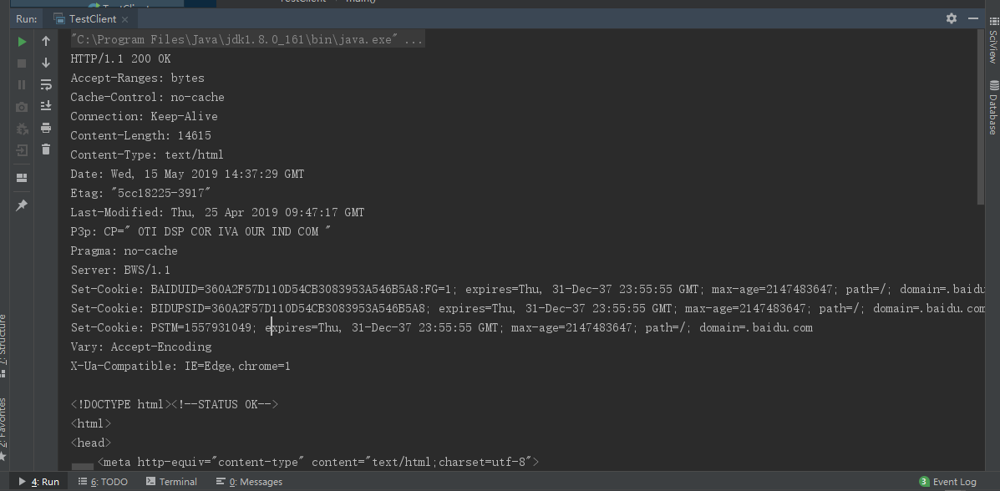
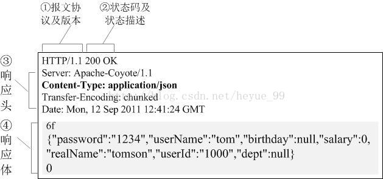
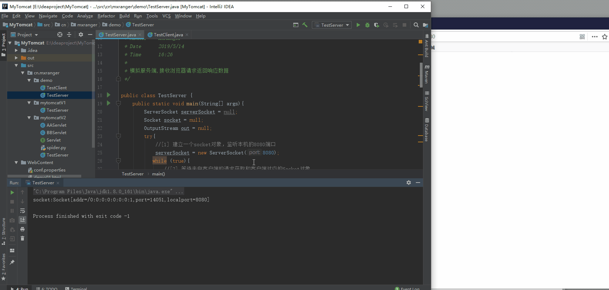
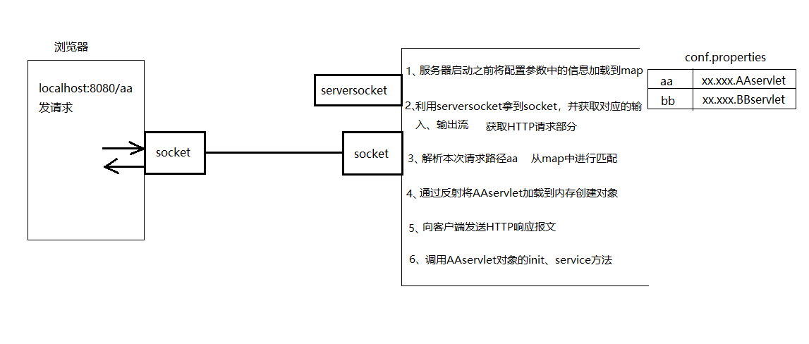
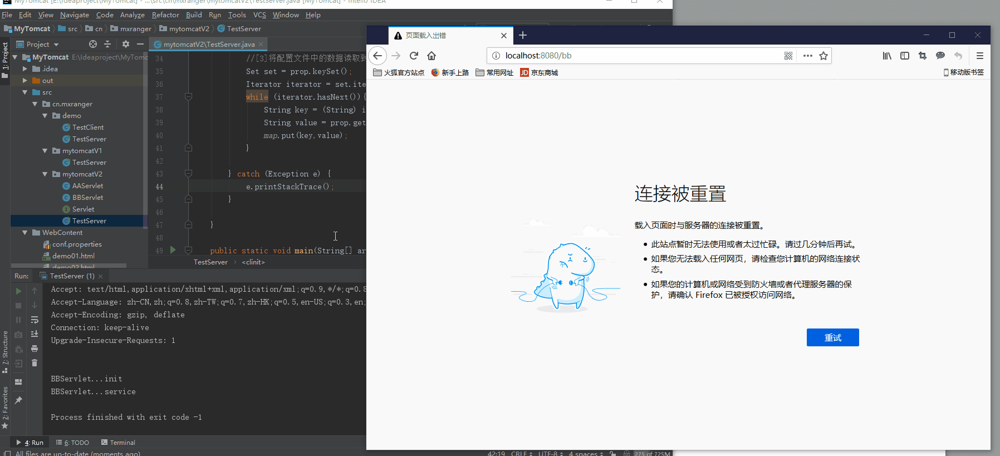

# 一、HTTP请求报文和响应报文

> [一次完整的HTTP请求过程](https://www.cnblogs.com/engeng/articles/5959335.html)https://www.cnblogs.com/engeng/articles/5959335.html

## 1、请求报文

一个HTTP请求报文由请求行（request line）、请求头部（header）和请求数据3个部分组成。


### 1、请求行

三部分组成：请求方法，请求URL（不包括域名），HTTP协议版本

#### 请求方法

请求方法比较多：GET、POST、HEAD、PUT、DELETE、OPTIONS、TRACE、CONNECT

最常用的是GET和POST。

#### HTTP协议版本

**1）HTTP/1.0**

HTTP/1.0支持：GET、POST、HEAD三种HTTP请求方法。

**2）HTTP/1.1**

HTTP/1.1是当前正在使用的版本。该版本默认采用持久连接，并能很好地配合代理服务器工作。还支持以管道方式同时发送多个请求，以便降低线路负载，提高传输速度。

HTTP/1.1新增了：OPTIONS、PUT、DELETE、TRACE、CONNECT五种HTTP请求方法。

### 2、请求头

User-Agent : 产生请求的浏览器类型

Accept : 客户端希望接受的数据类型，比如 Accept：text/xml（application/json）表示希望接受到的是xml（json）类型

Content-Type：发送端发送的实体数据的数据类型。
 比如，Content-Type：text/html（application/json）表示发送的是html类型。

Host : 请求的主机名，允许多个域名同处一个IP地址，即虚拟主机


|           Content-Type            |                             解释                             |
| :-------------------------------: | :----------------------------------------------------------: |
|             text/html             |                           html格式                           |
|            text/plain             |                          纯文本格式                          |
|             text/css              |                           CSS格式                            |
|          text/javascript          |                            js格式                            |
|             image/gif             |                         gif图片格式                          |
|            image/jpeg             |                         jpg图片格式                          |
|             image/png             |                         png图片格式                          |
| application/x-www-form-urlencoded | POST专用：普通的表单提交默认是通过这种方式。form表单数据被编码为key/value格式发送到服务器。 |
|         application/json          |   POST专用：用来告诉服务端消息主体是序列化后的 JSON 字符串   |
|             text/xml              |                    POST专用：发送xml数据                     |
|        multipart/form-data        |                      POST专用：下面讲解                      |

### 3、请求数据

最后一个请求头之后是一个空行，发送回车符和换行符，通知服务器以下不再有请求头。

<span style="color:red">**注意：请求头和请求体之间有空行**</span>

请求数据不在GET方法中使用，而是在POST方法中使用。POST方法适用于需要客户填写表单的场合。与请求数据相关的最常使用的请求头是Content-Type和Content-Length。

### 4、案例

以百度首页为例

```java
package cn.mxranger.demo;

import java.io.IOException;
import java.io.InputStream;
import java.io.OutputStream;
import java.net.Socket;

/**
 * ClassName TestClient
 * Author    MxRanger
 * Date      2019/5/14
 * Time      16:10
 *
 * 当成浏览器客户端,发送请求
 */

public class TestClient {

    public static void main(String[] args){
        Socket socket = null;
        InputStream in = null;
        OutputStream out = null;
        try {
            //[1] 建立一个socket对象，连接域名80端口
            socket = new Socket("www.baidu.com",80);
            //[2]获取输出流对象
            in = socket.getInputStream();
            //[3]获取输入流对象
            out = socket.getOutputStream();

            //[4] 将http协议的请求部分发送到服务端
            //请求行 /subject/about/index.html
            out.write("GET / HTTP/1.1\n".getBytes());
            //请求头
            out.write("HOST:www.baidu.com\n".getBytes());
            out.write("\n".getBytes());

            //[5]读取来自服务端的数据打印到控制台
            int i = in.read();
            while (i!=-1){
                System.out.print((char)i);
                i = in.read();
            }


        } catch (Exception e) {
            e.printStackTrace();
        }finally {
            //[6]释放资源
            try {
                if(null!=in){
                    in.close();
                    in = null;
                }
                if(null!=out){
                    out.close();
                    out = null;
                }
                if(null!=socket){
                    socket.close();
                    socket = null;
                }
            } catch (IOException e) {
                e.printStackTrace();
            }
        }
    }
}
```

结果如下：

以下是响应数据




## 2、响应报文

HTTP的响应报文也由三部分组成：**响应行+响应头+响应体**



### 1、响应行

三部分组成：HTTP协议版本 、状态码和状态描述


HTTP的响应状态码由5段组成：

- 1xx 消息，一般是告诉客户端，请求已经收到了，正在处理，别急...
- 2xx 处理成功，一般表示：请求收悉、我明白你要的、请求已受理、已经处理完成等信息.
- 3xx 重定向到其它地方。它让客户端再发起一个请求以完成整个处理。
- 4xx 处理发生错误，责任在客户端，如客户端的请求一个不存在的资源，客户端未被授权，禁止访问等。
- 5xx 处理发生错误，责任在服务端，如服务端抛出异常，路由出错，HTTP版本不支持等。


**以下是几个常见的状态码：** 
**200 OK** 
你最希望看到的，即处理成功！ 
**303 See Other** 
我把你redirect到其它的页面，目标的URL通过响应报文头的Location告诉你。
**304 Not Modified** 
告诉客户端，你请求的这个资源至你上次取得后，并没有更改，你直接用你本地的缓存吧，我很忙哦，你能不能少来烦我啊！ 
**404 Not Found** 
你最不希望看到的，即找不到页面。如你在google上找到一个页面，点击这个链接返回404，表示这个页面已经被网站删除了，google那边的记录只是美好的回忆。
**500 Internal Server Error**
看到这个错误，你就应该查查服务端的日志了，肯定抛出了一堆异常，别睡了，起来改BUG去吧！


### 2、响应头

常见的几个

| Connection       | 使用keep-alive特性                 |
| ---------------- | ---------------------------------- |
| Content-Encoding | 使用gzip方式对资源压缩             |
| Content-type     | MIME类型为html类型，字符集是 UTF-8 |
| Date             | 响应的日期                         |
| Server           | 使用的WEB服务器                    |


### 3、响应体

返回到浏览器显示的内容


### 4、案例

```java
package cn.mxranger.demo;

import java.io.IOException;
import java.io.OutputStream;
import java.net.ServerSocket;
import java.net.Socket;
import java.util.TreeSet;

/**
 * ClassName TestServer
 * Author    MxRanger
 * Date      2019/5/14
 * Time      16:26
 *
 * 模拟服务端,接收浏览器请求返回响应数据
 */

public class TestServer {
    public static void main(String[] args){
        ServerSocket serverSocket = null;
        Socket socket = null;
        OutputStream out = null;
        try{
            //[1] 建立一个socket对象，监听本机的8080端口
            serverSocket = new ServerSocket(8080);
           while (true){
               //[2] 等待来自客户端的请求获取和客户端对应的Socket对象
               socket = serverSocket.accept();
               System.out.println("socket:"+socket.toString());
               //[3] 通过获取到的Socket对象获取到输出流对象
               out = socket.getOutputStream();

               //[4] 通过获取到的输出流对象将HTTP协议的相应部分发送到客户端
               out.write("HTTP/1.1 200 OK\n".getBytes());
               out.write("Content-Type:text/html;charset=utf-8\n".getBytes());
               out.write("Server:Apache-Coyote/1.1\n".getBytes());
               //响应头和响应组之前是有换行的
               out.write("\n\n".getBytes());
               StringBuffer buf = new StringBuffer();
               buf.append("<html></html>");
               buf.append("<head><title>标题</title></head>");
               buf.append("<body>");
               buf.append("<h1> hello world</h1>");
               buf.append("<a href='http://www.baidu.com'>百度</a>");
               buf.append("</body>");
               buf.append("</html>");
               out.write(buf.toString().getBytes());
               out.flush();
           }
        }catch (Exception e){
            e.printStackTrace();
        }finally {
            //[6]释放资源
            try {
                if(null!=out){
                    out.close();
                    out = null;
                }
                if(null!=socket){
                    socket.close();
                    socket = null;
                }
            } catch (IOException e) {
                e.printStackTrace();
            }
        }
    }
}
```

结果如下：



# 二、实现简单的Tomcat服务器

大体流程如下：



## 1、编写Servlet接口

```java
package cn.mxranger.mytomcatV2;

import java.io.IOException;
import java.io.InputStream;
import java.io.OutputStream;

/**
 * ClassName Servlet
 * Author    MxRanger
 * Date      2019/5/15
 * Time      20:17
 */

//所有服务端的java小程序都要实现的接口
public interface Servlet {
    //初始化
    public void init();
    //服务
    public void Service(InputStream in, OutputStream out) throws IOException;
    //销毁
    public void destory();
}
```

## 2、自定义两个Servlet实现类

### 1、AAServlet类

```java
package cn.mxranger.mytomcatV2;

import java.io.IOException;
import java.io.InputStream;
import java.io.OutputStream;

/**
 * ClassName AAServlet
 * Author    MxRanger
 * Date      2019/5/15
 * Time      20:20
 */

public class AAServlet implements Servlet {
    @Override
    public void init() {
        System.out.println("AAServlet...init");
    }

    @Override
    public void Service(InputStream in, OutputStream out) throws IOException {
        System.out.println("AAServlet...service");
        out.write("hello world AAServlet".getBytes());
        out.flush();
    }

    @Override
    public void destory() {
        System.out.println("AAServlet...destory");
    }
}
```

### 2、BBServlet类

```java
package cn.mxranger.mytomcatV2;

import java.io.IOException;
import java.io.InputStream;
import java.io.OutputStream;

/**
 * ClassName AAServlet
 * Author    MxRanger
 * Date      2019/5/15
 * Time      20:20
 */

public class BBServlet implements Servlet {
    @Override
    public void init() {
        System.out.println("BBServlet...init");
    }

    @Override
    public void Service(InputStream in, OutputStream out) throws IOException {
        System.out.println("BBServlet...service");
        out.write("hello world BBServlet".getBytes());
        out.flush();
    }

    @Override
    public void destory() {
        System.out.println("BBServlet...destory");
    }
}
```

## 3、编写conf.properties配置文件

用来URL与类路径一一配对

```properties
aa=cn.mxranger.mytomcatV2.AAServlet
bb=cn.mxranger.mytomcatV2.BBServlet
```

## 4、创建TestServer类

### 1、定义变量

```java
//1、定义一个变量，存放服务端WebContent目录的绝对路径
public static String WEB_ROOT = System.getProperty("user.dir") + "/WebContent";

//2、定义静态变量，用于存放本次请求的静态页面名称
private static String url = "";

//3、定义一个静态类型map，存储服务端conf.properties的配置信息
private static Map<String,String> map = new HashMap<String,String>();
```

### 2、编写静态代码块

用来在服务器启动前加载配置文件到map中

```java
 static {
        //4、服务器启动之前将配置参数中的信息加载到map中

        //[1]创建一个Properties对象
        Properties prop = new Properties();
        try {
            //[2]加载WebContent目录下的conf.properties
            prop.load(new FileInputStream(WEB_ROOT+"/conf.properties"));

            //[3]将配置文件中的数据读取到map中
            Set set = prop.keySet();
            Iterator iterator = set.iterator();
            while (iterator.hasNext()){
                String key = (String) iterator.next();
                String value = prop.getProperty(key);
                map.put(key,value);
            }

        } catch (Exception e) {
            e.printStackTrace();
        }

    }
```

### 3、截取资源名称

将截取的资源名称放入url中

```java
/*
    *  获取HTTP协议的请求部分，截取客户端要访问的资源名称，将这个资源名称赋值给url
    * */
    private static void parse(InputStream in) throws IOException {
        //定义一个变量，存放HTTP协议谪求部分数据
        StringBuffer content = new StringBuffer(2048);
        //定义一个数组，存放HTTP协议请求部分数据
        byte[] buffer = new byte[2048];
        //定义一个变量i,代表读取数据到数组中之后，教据量的大小
        int i=-1;
        //读取客户端发送过来的数据，将数据读取到字节数组buffer中.i代表读取数据量的大小311字节
        i = in.read(buffer);
        // 通历字节数组，将数组中的数据追加到content变量中
        for (int j=0;j<i;j++){
            content.append((char)buffer[j]);
        }
        // 打印HTTP协议请求部分数据
        System.out.println("content::"+content);
        //截取客尸端要请求的资源路径demo.html，复制给url
        parseUrl(content.toString());
    }

    private static void parseUrl(String content) {
        //存放请求行的2个空格的位置
        int index1,index2;
        //获取http请求部分第1空格的位置
        index1 = content.indexOf(" ");
        if(index1!=-1){
            //获取http请求部分第2空格的位置
            index2 = content.indexOf(" ",index1 + 1);
            if(index2 > index1){
                //截取客尸端要请求的资源名称
                url = content.substring(index1 + 2 , index2);
            }
        }
    }
```

### 4、访问静态资源

```java
/*
    * 发送静态资源
    * */
    private static void sendStaticResource(OutputStream out) throws IOException {
        //定义一个字节数组，用于存放本次请求的静态资源demo01.html的内容
        byte[] bytes = new byte[2018];
        // 定义一个文件输入流，用户获取静态资源demoOl.html中的内容
        FileInputStream fis = null;
        try {
            //创建文件对象File,代表本次要请求的资源demo01.html
            File file = new File(WEB_ROOT,url);
            // 如果文件存在
            if (file.exists()){
                //向客户端输出HTTP协议的响应行/响应头
                out.write("HTTP/1.1 200 OK\n".getBytes());
                out.write("Content-Type:text/html;charset=utf-8\n".getBytes());
                out.write("Server:Apache-Coyote/1.1\n".getBytes());
                //响应头和响应组之前是有换行的
                out.write("\n".getBytes());
                // 获取到文件输入流对象
                fis = new FileInputStream(file);
                //读取静态资源demo01.html中的内容到数组中
                int ch = fis.read(bytes);
                while (ch!=-1){
                    // 将读取到数组中的内容通过输出流发送到客户端
                    out.write(bytes,0,ch);
                    ch = fis.read(bytes);
                }

            }else{
                // 如果文件不存在
                // 向客户端响应文件不存在消息
                out.write("HTTP/1.1 404 not found\n".getBytes());
                out.write("Content-Type:text/html;charset=utf-8\n".getBytes());
                out.write("Server:Apache-Coyote/1.1\n".getBytes());
                out.write("\n".getBytes());
                String errMsg = "file not found";
                out.write(errMsg.getBytes());
            }
        }catch (Exception e){
            e.printStackTrace();
        }finally {
            //释放文件输入流对象
            if(fis!=null){
                fis.close();
                fis = null;
            }
        }

```

### 5、访问动态资源

```java
    /*
    * 发送动态资源
    * */
    private static void sendDynamicResource(InputStream in, OutputStream out) throws Exception {
        //向客户端输出HTTP协议的响应行/响应头 发送到客户端
        out.write("HTTP/1.1 200 OK\n".getBytes());
        out.write("Content-Type:text/html;charset=utf-8\n".getBytes());
        out.write("Server:Apache\n".getBytes());
        //响应头和响应体之间是有换行的
        out.write("\n".getBytes());

        //判断map中是否存在一个key，这个key是否和本次带请求的资源路径一致
        if(map.containsKey(url)){
            //如果包含指定的key,获取到map中key对应的value部分
            String value = map.get(url);
            //通过反射将对应的java程序加载内存
            Class<?> clazz = Class.forName(value);
            Servlet servlet = (Servlet)clazz.newInstance();
            //执行init方法
            servlet.init();
            //执行service方法
            servlet.Service(in,out);
        }
    }
```

### 6、主函数

```java
public static void main(String[] args) throws Exception{

        System.out.println(map);

        //System.out.println(WEB_ROOT);
        ServerSocket serverSocket = null;
        Socket socket = null;
        OutputStream out = null;
        InputStream in = null;

        try {
            //3、 建立一个socket对象，监听本机的8080端口
            serverSocket = new ServerSocket(8080);
            while (true){
                //4、 等待来自客户端的请求获取和客户端对应的Socket对象
                socket = serverSocket.accept();
                //System.out.println("socket:"+socket.toString());
                //5、 通过获取到的Socket对象获取到输入、输出流对象
                out = socket.getOutputStream();
                in = socket.getInputStream();

                //6、 获取HTTP协议的请求部分，截取客户端要访问的资源名称，将这个资源名称赋值给url
                //demo01.html or aa ?
                //判断本次请求的是静态demo.html还是运行在服务端的java小程序
                parse(in);
                if(null!=url){
                    if (url.indexOf(".")!=-1){
                        //发送静态资源文件
                        //7、发送静态资源
                        sendStaticResource(out);
                    }else {
                        //发送动态资源
                        sendDynamicResource(in,out);
                    }
                }
            }
        } catch (IOException e) {
            e.printStackTrace();
        }finally {
            //[6]释放资源
            if(null!=in){
                in.close();
                in = null;
            }
            if(null!=out){
                out.close();
                out = null;
            }
            if(null!=socket){
                socket.close();
                socket = null;
            }
        }
    }
```

## 5、测试



